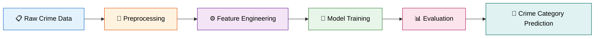
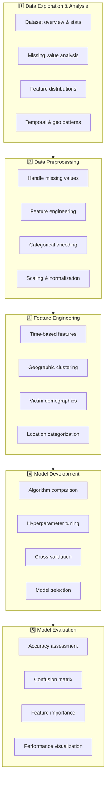
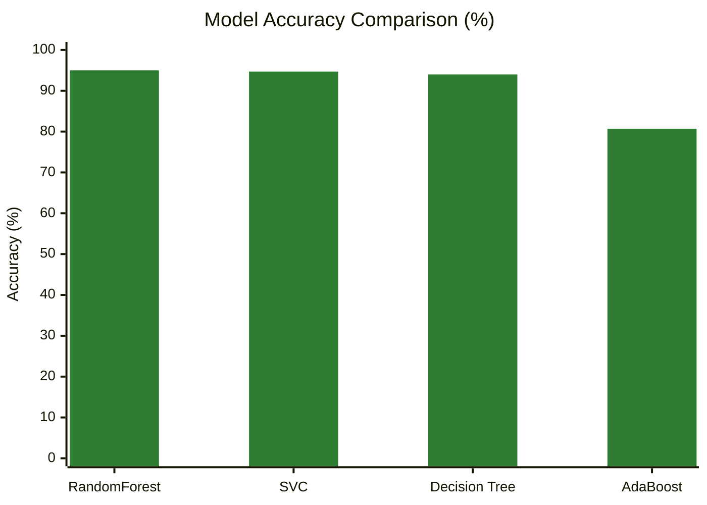

<div align="center">

# 🚨 CrimeCast: Forecasting Crime Categories

### Machine Learning for Predictive Crime Analytics

[](https://www.python.org/)
[](https://scikit-learn.org/)
[](https://pandas.pydata.org/)
[](https://jupyter.org/)
[](#)

[](#-model-performance)
[](#-dataset-information)
[](#-model-performance)

</div>

---

## 🎯 Project Overview

**CrimeCast** is a comprehensive machine learning project focused on predicting crime categories using historical crime incident data. This project analyzes location, timing, victim demographics, and incident characteristics to build accurate predictive models for law enforcement and public safety applications.



---

## 🔍 Problem Statement

The goal is to develop machine learning models capable of accurately predicting crime categories based on incident information. By leveraging data-driven insights, this project aims to:

- 🚓 **Enhance** law enforcement strategies
- 📍 **Improve** resource allocation for crime prevention
- 🛡️ **Bolster** public safety measures through predictive analytics
- 💡 **Transform** raw crime data into actionable intelligence

---

## 📊 Dataset Information

The dataset provides a comprehensive snapshot of criminal activities within the city, encompassing various aspects of each incident including date, time, location, victim demographics, and more.

| 📌 Stat | Value |
|---|---|
| **Size** | 5.79 MB |
| **Format** | CSV |
| **Evaluation Metric** | Accuracy Score |
| **Target Variable** | `Crime_Category` |

### 📁 Data Files Structure

```
CrimeCast/
├── data/
│   ├── train.csv              # Training dataset with target variable
│   ├── test.csv               # Test dataset for predictions
│   └── sample_submission.csv  # Sample submission format
├── notebooks/
│   └── crime_prediction.ipynb # Main analysis notebook
└── README.md                  # Project documentation
```

### 🏷️ Dataset Features

| Feature | Description |
|---|---|
| `Location` | Street address of the crime incident |
| `Cross_Street` | Cross street of the rounded address |
| `Latitude` / `Longitude` | Geographic coordinates of the incident |
| `Date_Reported` | Date the incident was reported |
| `Date_Occurred` | Date the incident occurred |
| `Time_Occurred` | Time of incident (24-hour military time) |
| `Area_ID` | LAPD's Geographic Area number |
| `Area_Name` | Name designation of the LAPD Geographic Area |
| `Reporting_District_no` | Reporting district number |
| `Part 1-2` | Crime classification |
| `Modus_Operandi` | Activities associated with the suspect |
| `Victim_Age` | Age of the victim |
| `Victim_Sex` | Gender of the victim |
| `Victim_Descent` | Descent code of the victim |
| `Premise_Code` | Premise code indicating location type |
| `Premise_Description` | Description of the premise code |
| `Weapon_Used_Code` | Weapon code indicating weapon type |
| `Weapon_Description` | Description of the weapon code |
| `Status` / `Status_Description` | Status of the case |
| `Crime_Category` | 🎯 **Target Variable** — Category of the crime |

---

## 🛠️ Technologies Used

<div align="center">

| Tool | Purpose |
|---|---|
| 🐍 **Python 3.8+** | Primary programming language |
| 🐼 **Pandas** | Data manipulation and analysis |
| 🔢 **NumPy** | Numerical computing |
| 🤖 **Scikit-learn** | Machine learning algorithms |
| 📈 **Matplotlib / Seaborn** | Data visualization |
| 📓 **Jupyter Notebook** | Interactive development environment |
| 📊 **Plotly** | Interactive visualizations (optional) |

</div>

---

## 🚀 Installation and Setup

### Prerequisites
- Python 3.8 or higher
- pip package manager

### Manual Installation

```bash
pip install pandas numpy scikit-learn matplotlib seaborn jupyter plotly
```

### Quick Start

```bash
# 1. Launch Jupyter Notebook
jupyter notebook

# 2. Open the analysis notebook
# notebooks/crime_prediction.ipynb

# 3. Execute all cells to reproduce the analysis
```

---

## 📋 Project Workflow



---

## 🎯 Usage Example

```python
# Load the trained model and make predictions
import pandas as pd
from sklearn.ensemble import RandomForestClassifier

# Load test data
test_data = pd.read_csv('data/test.csv')

# Preprocess test data (same as training)
test_processed = preprocess_data(test_data)

# Make predictions
predictions = model.predict(test_processed)

# Create submission file
submission = pd.DataFrame({
    'id': test_data.index,
    'crime_category': predictions
})
submission.to_csv('submission.csv', index=False)
```

---

## 📊 Key Insights and Findings

- ⏰ **Temporal Patterns** — Crime occurrence by time of day, day of week, and seasonal trends
- 🗺️ **Geographic Hotspots** — High-crime areas and geographic clustering
- 👥 **Demographic Analysis** — Victim demographics and their correlation with crime types
- ⭐ **Feature Importance** — Key factors that most influence crime category prediction

---

## 🏆 Model Performance

<div align="center">

| Model | Accuracy | Rank | Notes |
|---|:---:|:---:|---|
| 🥇 **RandomForest** | **95.0%** | 1st | Best performing model |
| 🥈 SVC | 94.7% | 2nd | Strong performance with support vectors |
| 🥉 Decision Tree | 94.0% | 3rd | Good interpretability |
| AdaBoost | 80.7% | 4th | Ensemble boosting method |

</div>

### 📈 Accuracy Comparison



> **Key Insight:** RandomForest achieved the highest accuracy of **95.0%**, making it the preferred model for crime category prediction. All top 3 models achieved **over 94% accuracy**, demonstrating strong predictive capability across ensemble, kernel-based, and tree-based approaches.

---

## 📁 File Structure

```
CrimeCast/
├── data/                     # Dataset files
├── crime_prediction.py       # Jupyter notebooks
└── README.md                 # Project documentation
```

---

## 🔮 Future Enhancements

- [ ] 🧠 **Deep Learning Models** — Implement neural networks for improved accuracy
- [ ] ⚡ **Real-time Prediction** — Develop API for real-time crime prediction
- [ ] 🗺️ **Geographic Visualization** — Interactive crime mapping dashboard
- [ ] 🔗 **Ensemble Methods** — Combine multiple models for better performance
- [ ] 📅 **Time Series Analysis** — Predict crime trends over time
- [ ] 🌦️ **External Data Integration** — Weather, events, economic indicators

---

## 🤝 Contributing

1. Fork the repository
2. Create a feature branch (`git checkout -b feature/amazing-feature`)
3. Commit your changes (`git commit -m 'Add amazing feature'`)
4. Push to the branch (`git push origin feature/amazing-feature`)
5. Open a Pull Request

---

## 👨‍💻 Author

<div align="center">

**Rajeev Kumar**

Student ID: `21f3001527`
Institution: Indian Institute of Technology Madras

[](https://github.com/21f3001527)
[](#)
[](mailto:21f3001527@ds.study.iitm.ac.in)

</div>

---

## 🙏 Acknowledgments

- **LAPD** for making crime data publicly available
- **Open source community** for excellent machine learning libraries
- **Fellow data scientists** for insights and collaboration

## 📚 References

- [Scikit-learn Documentation](https://scikit-learn.org/stable/documentation.html)
- [Pandas Documentation](https://pandas.pydata.org/docs/)
- Crime Data Analysis Best Practices

---

<div align="center">

⭐ **If you find this project useful, consider giving it a star!** ⭐

</div>
